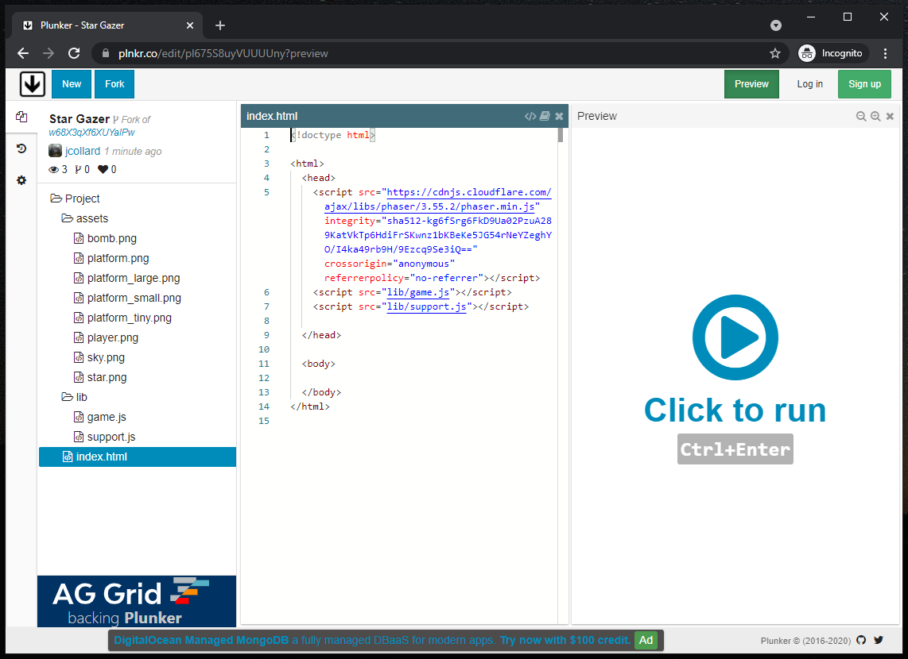
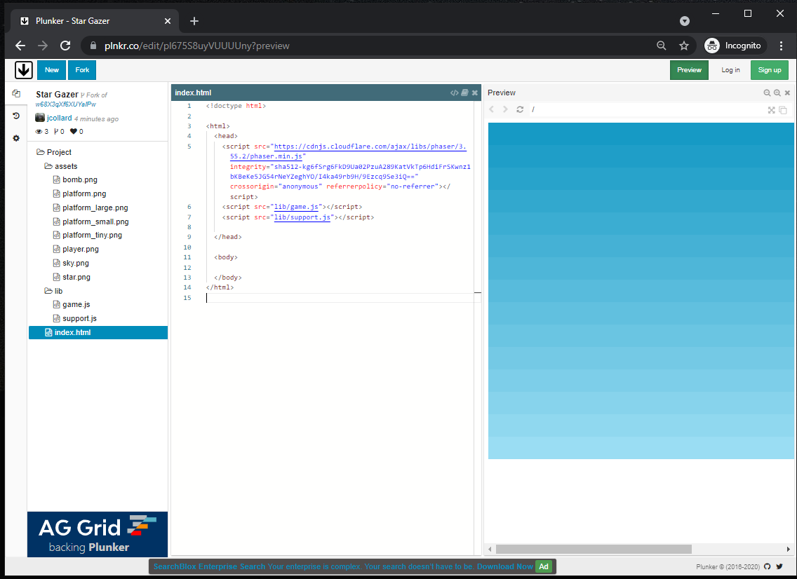
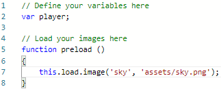
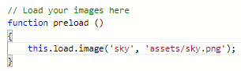
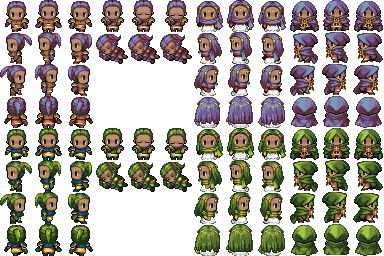
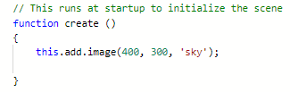
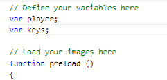
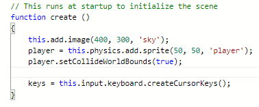
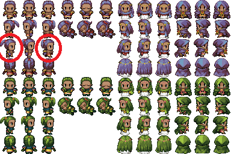

# Platformer with Phaser 3!

My email: jcollard@chadwickschool.org

## Table of Contents

- [Platformer with Phaser 3!](#platformer-with-phaser-3)
  - [Table of Contents](#table-of-contents)
  - [Overview](#overview)
  - [Part 1 - Setup](#part-1---setup)
  - [Part 2 - Adding the Player](#part-2---adding-the-player)
    - [The Player variable](#the-player-variable)
    - [Loading player.png](#loading-playerpng)
    - [Adding a Sprite](#adding-a-sprite)
  - [Part 3 - Player Movement](#part-3---player-movement)
    - [The Update Function](#the-update-function)
    - [First Challenge](#first-challenge)
  - [Part 4 - Adding Platforms](#part-4---adding-platforms)
    - [Second Challenge](#second-challenge)
  - [Part 5 - Making the Player Jump](#part-5---making-the-player-jump)
    - [Third Challenge](#third-challenge)
  - [Part 6 - Animating the Player](#part-6---animating-the-player)
    - [Fourth Challenge](#fourth-challenge)
    - [Facing Forward](#facing-forward)
    - [Fifth Challenge](#fifth-challenge)
    - [Sixth Challenge](#sixth-challenge)
  - [Part 7 - Adding Stars](#part-7---adding-stars)
    - [Seventh Challenge](#seventh-challenge)
  - [Part 8 - Collecting Stars](#part-8---collecting-stars)
  - [Finished Code](#finished-code)

## Overview

You will build a game in which the player jumps on platforms to collect stars.

## Part 1 - Setup

Open the project: https://plnkr.co/edit/pl675S8uyVUUUUny



This is the starter project. If you click the `Preview` button in the top right
corner, your screen should look like this:



Click the `Preview` button again to stop running the game.

## Part 2 - Adding the Player

### The Player variable

Find the `game.js` file in the file browser on the left and click it. This is
the JavaScript code that runs the game in the preview window.

First, we must create a variable for our player. For this program, we will put
all of our variables at the top of the `game.js` file.

On line 2, add `var player;` and a new line. When you're done, your code should
look like this:



### Loading player.png

Next, we must load the image we will use for the player.

Find the `preload` function:


 
 A function is a way to organize code. The `preload` function is used to load
 all of the images that our game will use. Let's start by adding the graphic for
 our player.

 Update your `preload` function to look like this:

```javascript
function preload ()
{
    this.load.image('sky', 'assets/sky.png');
    this.load.spritesheet('player', 'assets/player.png', { frameWidth: 32, frameHeight: 32 });
}
```

These two lines load images into the game and create a short-hand for us to use
it later. The first line loads the image `assets/sky.png` and creates the
short-hand `sky`. 

The second line loads the `assets/player.png` as a sprite sheet and creates the
short-hand `player`.

A sprite sheet is an image that contains multiple images inside of it. Our
player image actually looks like this:



The code above says that each of the images within the sprite sheet is 32 pixels
wide and 32 pixels tall.

### Adding a Sprite

Next, we need to add our player to the scene when the game starts. To do this,
we will update the `create` function. Find the create function:



Update the `create` function to add the player sprite:

```javascript
function create ()
{
    this.add.image(400, 300, 'sky');
    player = this.physics.add.sprite(50, 50, 'player');
}
```

The line you added creates a sprite at the position (50, 50) on the screen using
the `player` short-hand. If you click the `Preview` button in the top right, you
will see your character spawn at the top of the screen and then fall off.

When you're done, press the `Preview` button again.

To prevent our player from falling off the screen, we will update our code again
with this line of code: 
```javascript
player.setCollideWorldBounds(true);
```

Update your `create` function:

```javascript
function create ()
{
    this.add.image(400, 300, 'sky');
    player = this.physics.add.sprite(50, 50, 'player');
    player.setCollideWorldBounds(true);
}
```

## Part 3 - Player Movement

Next, we will make it so our character can be moved with the arrow keys.

First, create a variable to keep track of the arrow keys. At the top of your
`game.js` file, update your variable section to add a `keys` variable.




Next, we must assign the `keys` variable in our `create` function to be the
arrow keys on the keyboard. 



### The Update Function

The `update` function is executed while our game is running. This can be used to
check what keys are pressed and update the game.

We will add a check to see if the player is pressing the left key.

Update your `update` function to look like this:

```javascript
function update ()
{
    if (keys.right.isDown)
    {
        player.setVelocityX(160);
    }
}
```

The code we added is called an if statement. When the game is running, this
specific if statement checks to see if the right arrow key is being pressed. If
it is, it sets the speed of the player to move to the right.

Test it by pressing the `Preview` button in the top right.

When you're done, press the `Preview` button again to stop.

Notice, the player keeps moving to the right even after the button was release.
To fix this, we must specify what happens when the left key is pressed and when
no keys are pressed.

Update your `update` function to look like this:

```javascript
function update ()
{
    if (keys.right.isDown)
    {
        player.setVelocityX(160);
    } 
    else if (keys.left.isDown)
    {
        //TODO: Set player Y velocity to a negative value
    }
    else
    {
        //TODO: Set player X velocity to 0
    }
}
```

### First Challenge

Can you finish the `update` function so that the player moves to the left when
the left key is down and stops moving when no keys are pressed.

<details>
<summary>Click for Hint</summary>
To make the player move to the left, you can add this code
<pre>
player.setVelocityX(-160);    
</pre>
</details>  

<details>
<summary>Click for Solution</summary>
<pre>
function update ()
{
    if (keys.right.isDown)
    {
        player.setVelocityX(160);
    } 
    else if (keys.left.isDown)
    {
        //TODO: Set player Y velocity to a negative value
        player.setVelocityX(-160);
    }
    else
    {
        //TODO: Set player X velocity to 0
        player.setVelocityX(0);
    }
}
</pre>
</details>

## Part 4 - Adding Platforms

Next, let's add some platforms for our player to walk on.

Start by creating a `platforms` variable at the top of your `game.js` file.

```javascript
var platforms;
```

Next, load the platform images in your `preload` function.

```javascript
// Load your images here
function preload ()
{
    this.load.image('sky', 'assets/sky.png');
    this.load.spritesheet('player', 'assets/player.png', { frameWidth: 32, frameHeight: 32 });
    this.load.image('ground_tiny', 'assets/platform_tiny.png');
    this.load.image('ground_small', 'assets/platform_small.png');
    this.load.image('ground', 'assets/platform.png');
    this.load.image('ground_large', 'assets/platform_large.png');
}
```

Next, we must initialize our `platforms` variable in our `create` function.

```javascript
function create ()
{
    this.add.image(400, 300, 'sky');
    player = this.physics.add.sprite(50, 50, 'player');
    player.setCollideWorldBounds(true);

    keys = this.input.keyboard.createCursorKeys();

    platforms = this.physics.add.staticGroup();
}
```

The line `platforms = this.physics.add.staticGroup();` creates a group where we
can add multiple platforms.

Next, let's add a few platforms:

```javascript
function create ()
{
    this.add.image(400, 300, 'sky');
    player = this.physics.add.sprite(50, 50, 'player');
    player.setCollideWorldBounds(true);

    keys = this.input.keyboard.createCursorKeys();

    platforms = this.physics.add.staticGroup();

    platforms.create(50, 100, 'ground_tiny');
    platforms.create(80, 200, 'ground_small');
    platforms.create(180, 300, 'ground');
    platforms.create(50, 400, 'ground_large');
}
```

The code we added creates 4 platforms. Test it by clicking the `Preview` button.
When you're done, press the `Preview` button again.

Notice, the player falls through the platforms. To fix this, we need to specify
that the player should collide with the platforms. To do this, we add the code
`this.physics.add.collider(player, platforms);` after we have created all of our
platforms.

Add this line then Test your game again.

<details>
<summary>Click for Solution</summary>
<pre>
function create ()
{
    this.add.image(400, 300, 'sky');
    player = this.physics.add.sprite(50, 50, 'player');
    player.setCollideWorldBounds(true);

    keys = this.input.keyboard.createCursorKeys();

    platforms = this.physics.add.staticGroup();

    platforms.create(50, 100, 'ground_tiny');
    platforms.create(80, 200, 'ground_small');
    platforms.create(180, 300, 'ground');
    platforms.create(50, 400, 'ground_large');

    this.physics.add.collider(player, platforms);
}
</pre>
</details>

### Second Challenge

For this challenge, create several of platforms that your player can use to
navigate to the bottom of the screen. Add a few large platforms at the bottom so
the entire bottom of the screen is a large platform.

## Part 5 - Making the Player Jump

Next, let's make it so our player can jump to be able to climb up the platforms.

The following code will check to see if the up key is being pressed and also if
the player is currently on a platform. If this is true, it causes the player to
jump.

```javascript
if (keys.up.isDown && player.body.touching.down)
{
    player.setVelocityY(-330);
}
```

### Third Challenge

Add this code to the correct part of your program to make your player jump.

<details>
<summary>Click for Hint</summary>
The player controls should go in the update function
</details>  

<details>
<summary>Click for Solution</summary>
<pre>
function update ()
{
    if (keys.right.isDown)
    {
        player.setVelocityX(160);
    } 
    else if (keys.left.isDown)
    {
        //TODO: Set player Y velocity to a negative value
        player.setVelocityX(-160);
    }
    else
    {
        //TODO: Set player X velocity to 0
        player.setVelocityX(0);
    }
    
    if (keys.up.isDown && player.body.touching.down)
    {
        player.setVelocityY(-330);
    }
}
</pre>
</details>

## Part 6 - Animating the Player

Currently, our player is always facing forward. The code below defines an
animation for when our player is moving to the left:

```javascript
    this.anims.create({
        key: 'right',
        frames: this.anims.generateFrameNumbers('player', { start: 24, end: 26 }),
        frameRate: 10,
        repeat: -1
    });
```

The important pieces here are the `key` which defines the name of this
animation. In this case, we have given it the name `right`.

The `frames` specifies that we ant to use the player sprite sheet and that we
will start with sprite 24 and end with sprite 26.



The `frameRate` specifies how fast the animation is.

The `repeat` specifies how many times the animation should repeat. In this case,
`-1` means to loop forever.

Add this code to the end of your `create` function to add the left animation.

Note, your platforms will look different but, your code will look something like
this:

```javascript
function create ()
{
    this.add.image(400, 300, 'sky');
    player = this.physics.add.sprite(50, 50, 'player');
    player.setCollideWorldBounds(true);

    keys = this.input.keyboard.createCursorKeys();

    platforms = this.physics.add.staticGroup();

    // Your platforms here

    this.physics.add.collider(player, platforms);

    this.anims.create({
        key: 'right',
        frames: this.anims.generateFrameNumbers('player', { start: 24, end: 26 }),
        frameRate: 10,
        repeat: -1
    });
}
```

### Fourth Challenge


Next, we need to make it so when the player is moving right, the right animation
is playing. The following code plays the `right` animation:

```javascript
player.anims.play('right', true);
```

Can you figure out the correct place to put this line of code?

<details>
<summary>Click for Hint</summary>
What code causes the player's velocity to move to the right?
</details>  

<details>
<summary>Click for Solution</summary>
<pre>
function update ()
{
    if (keys.right.isDown)
    {
        player.setVelocityX(160);
        player.anims.play('right', true);
    } 
    else if (keys.left.isDown)
    {
        //TODO: Set player Y velocity to a negative value
        player.setVelocityX(-160);
    }
    else
    {
        //TODO: Set player X velocity to 0
        player.setVelocityX(0);
    }

    if (keys.up.isDown && player.body.touching.down)
    {
        player.setVelocityY(-330);
    }
}
</pre>
</details>

### Facing Forward

You'll notice that once the player starts moving to the right, the animation
will continue to play forever. Next, we will define a `forward` animation which
is a single image that we will use to make the player face forward when they are
not moving.

```javascript
this.anims.create({
        key: 'forward',
        frames: [ { key: 'player', frame: 1 } ],
        frameRate: 20
});
```

Add this code to the end of your `create` function.

Your code should look like this:

```javascript
function create ()
{
    this.add.image(400, 300, 'sky');
    player = this.physics.add.sprite(50, 50, 'player');
    player.setCollideWorldBounds(true);

    keys = this.input.keyboard.createCursorKeys();

    platforms = this.physics.add.staticGroup();

    // Your platforms here

    this.physics.add.collider(player, platforms);

    this.anims.create({
        key: 'right',
        frames: this.anims.generateFrameNumbers('player', { start: 24, end: 26 }),
        frameRate: 10,
        repeat: -1
    });

    this.anims.create({
        key: 'forward',
        frames: [ { key: 'player', frame: 1 } ],
        frameRate: 20
    });
}
```

### Fifth Challenge

Can you figure out what code needs to be written to play the `forward`
animation? Can you figure out where to put that code? 

<details>
<summary>Click for hint</summary>
The following code will cause the player to face forward:
<pre>
player.anims.play('forward', true);
</pre>
</details>  

<details>
<summary>Click for another hint</summary>
What part of the code sets the players velocity to 0?
</details>  

<details>
<summary>Click for Solution</summary>
<pre>
function update ()
{
    if (keys.right.isDown)
    {
        player.setVelocityX(160);
        player.anims.play('right', true);
    } 
    else if (keys.left.isDown)
    {
        //TODO: Set player Y velocity to a negative value
        player.setVelocityX(-160);
    }
    else
    {
        //TODO: Set player X velocity to 0
        player.setVelocityX(0);
        player.anims.play('forward', true);
    }

    if (keys.up.isDown && player.body.touching.down)
    {
        player.setVelocityY(-330);
    }
}
</pre>
</details>

### Sixth Challenge

Can you write the code to animate the player moving to the left? You should
start on frame 12 and end on frame 24. Add this code to your `create` function

<details>
<summary>Click for hint</summary>
The following code creates the animation that moves the player to the right. Can you modify it to move to the left?
<pre>
this.anims.create({
    key: 'right',
    frames: this.anims.generateFrameNumbers('player', { start: 24, end: 26 }),
    frameRate: 10,
    repeat: -1
});
</pre>
</details>  

<details>
<summary>Click for Solution</summary>
<pre>
this.anims.create({
    key: 'left',
    frames: this.anims.generateFrameNumbers('player', { start: 12, end: 14 }),
    frameRate: 10,
    repeat: -1
});
</pre>
</details>

Now, add the code to the `update` function that will cause the animation to play
when the player presses the left arrow.

<details>
<summary>Click for hint</summary>
The following code will cause the player to animate running left:
<pre>
player.anims.play('left', true);
</pre>
</details>  

<details>
<summary>Click for another hint</summary>
What part of the code sets the players velocity to move to the left?
</details>  

<details>
<summary>Click for Solution</summary>
<pre>
function update ()
{
    if (keys.right.isDown)
    {
        player.setVelocityX(160);
        player.anims.play('right', true);
    } 
    else if (keys.left.isDown)
    {
        //TODO: Set player Y velocity to a negative value
        player.setVelocityX(-160);
        player.anims.play('left', true);
    }
    else
    {
        //TODO: Set player X velocity to 0
        player.setVelocityX(0);
        player.anims.play('forward', true);
    }

    if (keys.up.isDown && player.body.touching.down)
    {
        player.setVelocityY(-330);
    }
}
</pre>
</details>

## Part 7 - Adding Stars

Now that our player can move around the play area, we will add stars for them to
collect.

First, add a new variable at the top of your `game.js` file called `stars`.

```
var stars;
```

Next, load the star image in the `preload` function.

```javascript
function preload ()
{
    this.load.image('sky', 'assets/sky.png');
    
    this.load.spritesheet('player', 'assets/player.png', { frameWidth: 32, frameHeight: 32 });

    this.load.image('ground_tiny', 'assets/platform_tiny.png');
    this.load.image('ground_small', 'assets/platform_small.png');
    this.load.image('ground', 'assets/platform.png');
    this.load.image('ground_large', 'assets/platform_large.png');

    this.load.image('star', 'assets/star.png');
}
```

In the `create` function, we will create a new group to store our stars:

```javascript
stars = this.physics.add.group();
```

Finally, we can place stars in our scene by using the following code:

```javascript
stars.add(this.physics.add.sprite(100, 200, 'star'));
```

Be sure to replace `100` with the x position you want and `200` with the y
position that you want.

After you've added a few stars, you can test your scene by clicking the
`Preview` button. When you're done, press it again.

### Seventh Challenge

Notice, your stars will fall through your platforms! To fix this, we will need
to add a collider between our stars and platforms. Can you write this code and
add it to your `create` function.

<details>
<summary>Click for hint</summary>
The following code adds a collider between the player and platforms. Can you modify it to add a collider between your stars and platforms?
<pre>
this.physics.add.collider(player, platforms);
</pre>
</details>  

<details>
<summary>Click for Solution</summary>
<pre>
this.physics.add.collider(stars, platforms);
</pre>
</details>

## Part 8 - Collecting Stars

When the player touches a star, we want them to collect it and remove it from
the scene.

To do this, we will define our own function `collectStar`. At the bottom of the
`game.js` file add the following code:

```javascript
function collectStar (player, star)
{
    star.disableBody(true, true);
}
```

Make sure this code is not part of your `update` function. 

This function will make a star that the player touches disappear. To make this
work, we must specify in our `create` function that w should use it when the
`player` overlaps with a star.

Add the following code to the end of your `create` function:

```javascript
this.physics.add.overlap(player, stars, collectStar, null, this);
```

You can now play your game by pressing the `Preview` button. 


Congratulations! You've made your very own platformer!

## Finished Code

Your final code will look similar to this:

```javascript
// Define your variables here
var player;
var keys;
var stars;

// Load your images here
function preload ()
{
    this.load.image('sky', 'assets/sky.png');
    
    this.load.spritesheet('player', 'assets/player.png', { frameWidth: 32, frameHeight: 32 });

    this.load.image('ground_tiny', 'assets/platform_tiny.png');
    this.load.image('ground_small', 'assets/platform_small.png');
    this.load.image('ground', 'assets/platform.png');
    this.load.image('ground_large', 'assets/platform_large.png');

    this.load.image('star', 'assets/star.png');
}

// This runs at startup to initialize the scene
function create ()
{
    this.add.image(400, 300, 'sky');
    player = this.physics.add.sprite(50, 50, 'player');
    player.setCollideWorldBounds(true);

    keys = this.input.keyboard.createCursorKeys();

    platforms = this.physics.add.staticGroup();

    platforms.create(50, 100, 'ground_tiny');
    platforms.create(80, 200, 'ground_small');
    platforms.create(180, 300, 'ground');
    platforms.create(50, 400, 'ground_large');

    this.physics.add.collider(player, platforms);

    this.anims.create({
        key: 'right',
        frames: this.anims.generateFrameNumbers('player', { start: 24, end: 26 }),
        frameRate: 10,
        repeat: -1
    });

    this.anims.create({
        key: 'forward',
        frames: [ { key: 'player', frame: 1 } ],
        frameRate: 20
    });

    this.anims.create({
        key: 'left',
        frames: this.anims.generateFrameNumbers('player', { start: 12, end: 14 }),
        frameRate: 10,
        repeat: -1
    });

    stars = this.physics.add.group();
    stars.add(this.physics.add.sprite(100, 200, 'star'));
    this.physics.add.collider(stars, platforms);
    this.physics.add.overlap(player, stars, collectStar, null, this);
}

// This function is run every frame
// Put your player controls here
function update ()
{
    if (keys.right.isDown)
    {
        player.setVelocityX(160);
        player.anims.play('right', true);
    } 
    else if (keys.left.isDown)
    {
        //TODO: Set player Y velocity to a negative value
        player.setVelocityX(-160);
        player.anims.play('left', true);
    }
    else
    {
        //TODO: Set player X velocity to 0
        player.setVelocityX(0);
        player.anims.play('forward', true);
    }

    if (keys.up.isDown && player.body.touching.down)
    {
        player.setVelocityY(-330);
    }
}

function collectStar (player, star)
{
    star.disableBody(true, true);
}
```
